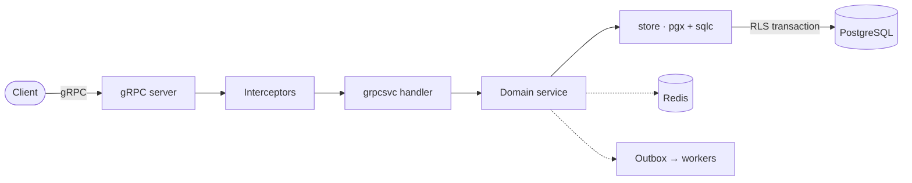

<div align="center">

# go-grpc-starter

**A gRPC-native Go backend template.**
Coherent, batteries-included foundations (PostgreSQL, Redis, background
workers, and clean extension seams) designed for gRPC from day one.

</div>

---

## Highlights

- **gRPC-first**: protobuf API, one package per domain, generated with buf.
- **PostgreSQL**: pgx + sqlc, every write in a row-level-security transaction.
- **Redis**: caching and opaque access tokens.
- **Transactional outbox**: reliable events with Asynq background workers.
- **Typed, localized errors**: mapped to gRPC status in exactly one place.
- **Optional HTTP/JSON gateway**: grpc-gateway transcoding, off by default.

## Stack

| Concern | Choice |
| --- | --- |
| API / transport | gRPC + Protobuf (buf) |
| Persistence | PostgreSQL · pgx + sqlc · row-level security |
| Cache / tokens | Redis |
| Background work | Asynq (email, push, event dispatch) |
| Migrations | golang-migrate |
| REST (optional) | grpc-gateway transcoding |

## Architecture



## Quick start

```sh
cp .env.example .env
just up        # postgres + redis + minio
just migrate   # apply migrations
just run       # gRPC server on :8080
```

> [!TIP]
> The server exposes gRPC reflection, so
> `grpcurl -plaintext localhost:8080 list` works immediately. See
> [Getting started](docs/getting-started.md).

## Documentation

| Guide | Contents |
| --- | --- |
| [Getting started](docs/getting-started.md) | prerequisites, setup, calling the API |
| [Architecture](docs/architecture.md) | layers, request lifecycle, interceptors, errors |
| [gRPC API](docs/grpc.md) | proto layout, adding RPCs and services |
| [HTTP/JSON gateway](docs/gateway.md) | optional REST transcoding |
| [Authentication](docs/authentication.md) | tokens, sessions, verification |
| [Database & migrations](docs/database.md) | schemas, roles, RLS, migrations |
| [Events & workers](docs/events.md) | outbox, dispatch, handlers |

Contributor and agent guidance lives in [AGENTS.md](AGENTS.md).
