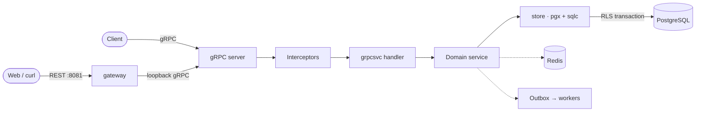

<div align="center">

# go-grpc-starter

**A gRPC-native Go backend template.**
Coherent, batteries-included foundations (PostgreSQL, Redis, background
workers, and clean extension seams) designed for gRPC from day one.

</div>

---

## Highlights

- **gRPC-first**: protobuf API, one package per domain, generated with buf.
- **Request validation**: buf.validate rules enforced by a protovalidate
  interceptor on unary and streaming RPCs.
- **PostgreSQL**: pgx + sqlc, every write in a row-level-security transaction.
- **Redis**: caching, opaque access tokens, and login lockout.
- **Transactional outbox**: reliable events with Asynq background workers,
  dead-lettering, and retention sweeps.
- **Typed, localized errors**: mapped to gRPC status in exactly one place.
- **React Email templates**: token-driven design system compiled to static
  HTML per locale, sent through Resend with variable substitution.
- **Observability**: Prometheus metrics for RPCs, pools, outbox, and cache;
  health/readiness endpoints on API and worker; optional pprof.
- **Hardened auth**: argon2id, rotating refresh-token families with reuse
  detection, per-account lockout, session revocation on password change.
- **HTTP surface**: an always-on grpc-gateway REST/JSON mirror plus raw
  webhook endpoints, on a second port, sharing one auth and error model.

## Stack

| Concern | Choice |
| --- | --- |
| API / transport | gRPC + Protobuf (buf) |
| Persistence | PostgreSQL · pgx + sqlc · row-level security |
| Cache / tokens | Redis |
| Background work | Asynq (email, push, event dispatch, webhooks) |
| Migrations | golang-migrate |
| REST + webhooks | grpc-gateway transcoding · raw net/http handlers |

## Architecture



## Quick start

```sh
cp .env.example .env
just up        # postgres + redis + minio
just migrate   # apply migrations
just run       # gRPC on :8080, HTTP surface on :8081
```

> [!TIP]
> The server exposes gRPC reflection, so
> `grpcurl -plaintext localhost:8080 list` works immediately, and the REST
> mirror answers on `:8081`. See [Getting started](docs/getting-started.md).

## Documentation

| Guide | Contents |
| --- | --- |
| [Getting started](docs/getting-started.md) | prerequisites, setup, calling the API |
| [Architecture](docs/architecture.md) | layers, request lifecycle, interceptors, errors |
| [gRPC API](docs/grpc.md) | proto layout, adding RPCs and services |
| [HTTP surface](docs/gateway.md) | REST transcoding, webhooks, CORS |
| [Authentication](docs/authentication.md) | tokens, sessions, verification |
| [Database & migrations](docs/database.md) | schemas, roles, RLS, migrations |
| [Events & workers](docs/events.md) | outbox, dispatch, handlers |

Contributor and agent guidance lives in [AGENTS.md](AGENTS.md).
