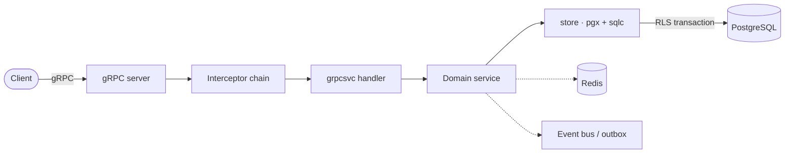
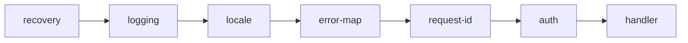
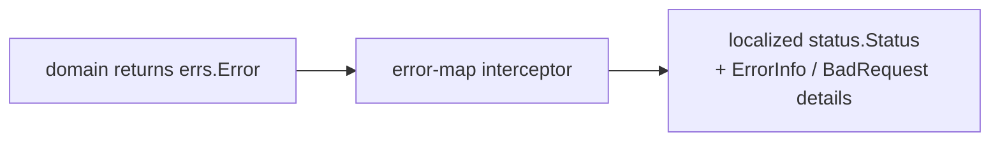

# Architecture

> How a request flows through the system, and where each responsibility lives.

## Request lifecycle

The handler layer only maps protobuf to and from domain types; all rules
live in the domain services, which are transport-agnostic.

## Layers

| Layer | Package | Responsibility |
| --- | --- | --- |
| Transport | `internal/grpcsvc`, `internal/interceptor` | protobuf ↔ domain mapping, cross-cutting concerns |
| Domain | `internal/<domain>` | business rules and entities, transport-agnostic |
| Data | `internal/store` (pgx + sqlc), per-domain repositories | persistence inside RLS-scoped transactions |
| Platform | `internal/platform`, `internal/event` | database pool, cache, object storage, event bus |

## Interceptor chain

Unary interceptors run outermost to innermost. Each wraps the next, so
the order matters: recovery is outermost (it catches panics from
everything inside), auth is innermost (it runs last, just before the
handler).

| Interceptor | Role |
| --- | --- |
| `recovery` | converts panics into a safe `Internal` status |
| `logging` | logs method, status code, and duration |
| `locale` | resolves the request language into the context |
| `error-map` | maps domain errors to localized gRPC status |
| `request-id` | attaches or propagates a request id |
| `auth` | validates the token, loads the session, sets the subject |

> [!NOTE]
> Public methods (no token required) and the admin-only prefix are
> declared in [`internal/interceptor/interceptors.go`](../internal/interceptor/interceptors.go).

## Errors

Domain code returns typed errors from `internal/errs` — a gRPC
`codes.Code`, a machine-readable app code, and an i18n message key. The
`error-map` interceptor is the **only** place that turns these into a
`status.Status` with details.

Because mapping is centralized, services never build status errors and
no HTTP status codes appear anywhere in the codebase.

---

**See also:** [gRPC API](grpc.md) · [Database](database.md) · [Events & workers](events.md)
