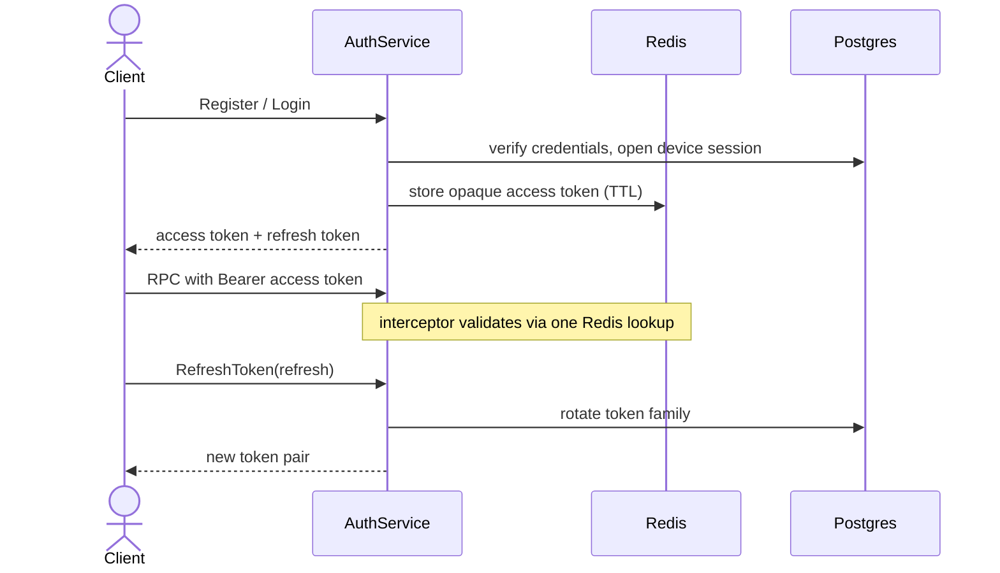

# Authentication

> Email/password auth with opaque access tokens and rotating refresh
> tokens, scoped to device sessions.

## Flow

## Tokens

| Token | Stored where | Notes |
| --- | --- | --- |
| Access | Redis, with TTL | random opaque string; validated by a single lookup, no JWT parsing |
| Refresh | `auth.refresh_tokens` (SHA-256 hash only) | rotates within a family; reusing a revoked token revokes the whole family |

## Sessions

Every login opens a row in `auth.device_sessions`. Revoking a session
blocks its access token immediately. Users can list and revoke their own
devices, and the oldest session is evicted once the per-user device limit
is reached.

## Email verification & password reset

Verification and reset tokens live in Redis with a TTL. The email worker
delivers the message; on use, the token maps back to the user.

> [!IMPORTANT]
> This template ships email/password auth as a worked example. Swap in
> whatever a downstream project needs — the interceptor only depends on
> the opaque-token contract, not on how tokens are issued.

---

**See also:** [Architecture](architecture.md) · [Database](database.md)
