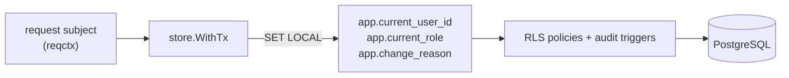

# Database & migrations

> PostgreSQL through pgx + sqlc, with row-level security enforced on
> every transaction.

Queries are written in `internal/store/query/*.sql` and compiled to
type-safe Go in `gen/db` with `just sqlc`. The `internal/store` package
owns the pool and runs every operation in an RLS-scoped transaction.

Schemas: `auth`, `notifications`, `audit`, `events`.

## Roles

| Role | Used by | Access |
| --- | --- | --- |
| `app_owner` | migrations | owns schemas and tables (DDL) |
| `app_api` | the gRPC server | read/write app tables |
| `app_worker` | workers, outbox drain | read/write, including audit |
| `app_readonly` | dashboards | select only |

Roles, schemas, and extensions are provisioned by
`infra/postgres/init/00-init.sql` on first container start.

## Row-level security

Tables enable `FORCE ROW LEVEL SECURITY`. Each store transaction sets
three transaction-local GUCs, which the schema's RLS policies and audit
triggers read:



The app role has full access (the API always scopes queries to the
caller); the read-only role is select-only. Because `current_user_id` is
available per transaction, any table you add can tighten a policy to
owner-only.

## Migrations

Paired `NNNNNN_name.up.sql` / `.down.sql` files, applied with
golang-migrate. Every run is recorded in `public.migration_history`.

```sh
just migrate            # apply pending
just migrate-down 1     # roll back one
just migrate-create x   # scaffold a new pair
just migrate-status     # current version
```

---

**See also:** [Architecture](architecture.md) · [Events & workers](events.md)
