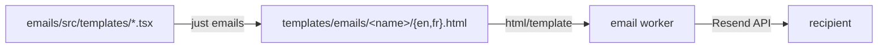

# Email templates

Transactional emails are authored as React Email components in
[`emails/`](../emails/) and compiled to static HTML under
[`templates/emails/`](../templates/emails/). The Go worker never runs
Node: it loads the generated files at startup and sends them through
Resend.



## Layout

```text
emails/
  src/
    theme/tokens.ts     design tokens: brand, colors, typography, layout
    components/         shared pieces built from tokens
      layout.tsx        EmailLayout: header, card, footer
      button.tsx        PrimaryButton
      typography.tsx    Title, Paragraph, Muted, FallbackLink
    templates/          one file per template, copy for every locale
    vars.ts             goVar helper and the Locale type
    build.tsx           renders every template x locale to HTML
templates/emails/       generated output, committed, do not edit
```

## Commands

| Command | Action |
| --- | --- |
| `just emails` | render all templates to `templates/emails/` |
| `just emails-dev` | live preview server with hot reload |
| `pnpm -C emails typecheck` | type-check the sources |

CI rebuilds the templates and fails if `templates/emails/` differs from
the committed output, so generated HTML can never drift from its
source.

## Variables

Templates embed Go template actions with the `goVar` helper:
`goVar("URL")` renders as `{{.URL}}` in the HTML. At send time the
worker executes the file with `html/template` and the `TemplateData`
map from the queued email.

| Variable | Provided by | Used in |
| --- | --- | --- |
| `URL` | action link built by the sender | button and fallback link |
| `Token` | raw one-time token | available to any template |
| `Year` | current year | footer copyright |

The sender side of the contract lives in
[`internal/app/email_sender.go`](../internal/app/email_sender.go);
template names are constants in
[`internal/worker/emails/templates.go`](../internal/worker/emails/templates.go).

## Locales

Each template exports a copy record per locale (`en`, `fr`). The build
writes one file per locale; the worker picks `<lang>.html` from the
email's `Language` field and falls back to the default language.
Subjects are not part of the HTML: they come from
[`locales/`](../locales/) through go-i18n, next to every other
user-facing string.

To add a locale, extend `locales` in `emails/src/vars.ts`, add the copy
to each template, add the subject keys to `locales/<lang>.toml`, and run
`just emails`.

## Customizing the design system

Everything visual flows from [`emails/src/theme/tokens.ts`](../emails/src/theme/tokens.ts):
brand name and logo, palette, font stack and sizes, card width, radii,
and paddings. A downstream project restyles every email by editing that
one file and running `just emails`. New shared pieces belong in
`emails/src/components/` and should only read from tokens.

## Adding a template

1. Create `emails/src/templates/<name>.tsx`: export the copy record,
   default-export the component, set `PreviewProps` for the dev server.
2. Register it in `emails/src/build.tsx` with its output name.
3. Run `just emails` and commit the generated HTML.
4. Add the template name constant to
   `internal/worker/emails/templates.go` and enqueue an
   `emails.Email` with that `TemplateID`, a `Language`, and the
   `TemplateData` the template reads.

---

**See also:** [Events & workers](events.md) · [Architecture](architecture.md)
