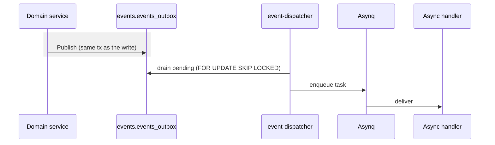

# Events & workers

> Domain changes publish events through a transactional outbox, so no
> event is lost if the process crashes after commit.

## Outbox

`Bus.Publish` writes the event to `events.events_outbox` in the **same
transaction** as the domain change. The event-dispatcher worker drains
pending rows and re-publishes them, enqueuing Asynq tasks for async
handlers.

Each batch is claimed and processed inside one transaction, so
`FOR UPDATE SKIP LOCKED` holds the rows for the whole batch and any
number of worker replicas can drain concurrently without
double-dispatching. The drain loops while full batches keep coming
(`batch_size` in `configs/events.yaml`), so throughput is bounded by
the database, not the tick interval. Redeliveries are absorbed by task
ids: a duplicate enqueue counts as success, never as a failure to
retry.

## Workers

All workers run in one process (`cmd/worker`); Asynq isolates them by
queue.

| Worker | Queues | Job |
| --- | --- | --- |
| `event_dispatcher` | `events:{high,normal,low}` | drain the outbox, run async handlers |
| `email_sender` | `emails:{high,normal,low}` | send transactional email |
| `push_notifications` | `notifications:{high,normal,low}` | send FCM push |

Queues are namespaced per worker so each Asynq server only consumes
tasks it has handlers for. Tasks carry a default timeout and bounded
retries, and payloads that fail to decode skip retries and go straight
to the archived set.

The worker also runs a retention sweeper
([`internal/maintenance`](../internal/maintenance/sweeper.go)) that
periodically deletes stale refresh tokens, processed outbox rows, and
old login attempts per `configs/maintenance.yaml`, and serves metrics
and health endpoints on `:9091`.

## Scaling

Every part of the pipeline scales horizontally: run more `cmd/worker`
replicas and they share queues and drain batches safely. Tune
`EVENTS_WORKER_CONCURRENCY` (handlers per replica),
`EMAIL_WORKER_CONCURRENCY`, `NOTIFICATION_WORKER_CONCURRENCY`, and
`EVENTS_OUTBOX_BATCH_SIZE` per environment. Watch
`app_asynq_queue_depth` and `app_asynq_queue_latency_seconds` (exported
by both processes): sustained pending growth means add replicas or
concurrency, growing retry counts mean a failing dependency, and
anything archived needs an operator.

## Add a handler

1. Define the event type in `internal/event/types_*.go` and register it.
2. Publish it from a domain service with `bus.Publish`.
3. Subscribe in [`internal/app/wire_events.go`](../internal/app/wire_events.go):
   `Subscribe` for synchronous handlers, `SubscribeAsync` for
   outbox-backed asynchronous ones.

---

**See also:** [Architecture](architecture.md) · [Database](database.md)
