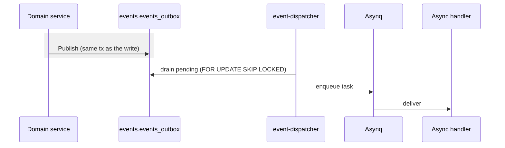

# Events & workers

> Domain changes publish events through a transactional outbox, so no
> event is lost if the process crashes after commit.

## Outbox

`Bus.Publish` writes the event to `events.events_outbox` in the **same
transaction** as the domain change. The event-dispatcher worker drains
pending rows and re-publishes them, enqueuing Asynq tasks for async
handlers.

`FOR UPDATE SKIP LOCKED` makes the drain safe to run across multiple
replicas.

## Workers

All workers run in one process (`cmd/worker`); Asynq isolates them by
queue.

| Worker | Queue | Job |
| --- | --- | --- |
| `event_dispatcher` | outbox | drain the outbox, run async handlers |
| `email_sender` | emails | send transactional email |
| `push_notifications` | notifications | send FCM push |

The worker also runs a retention sweeper
([`internal/maintenance`](../internal/maintenance/sweeper.go)) that
periodically deletes stale refresh tokens, processed outbox rows, and
old login attempts per `configs/maintenance.yaml`, and serves metrics
and health endpoints on `:9091`.

## Add a handler

1. Define the event type in `internal/event/types_*.go` and register it.
2. Publish it from a domain service with `bus.Publish`.
3. Subscribe in [`internal/app/wire_events.go`](../internal/app/wire_events.go):
   `Subscribe` for synchronous handlers, `SubscribeAsync` for
   outbox-backed asynchronous ones.

---

**See also:** [Architecture](architecture.md) · [Database](database.md)
