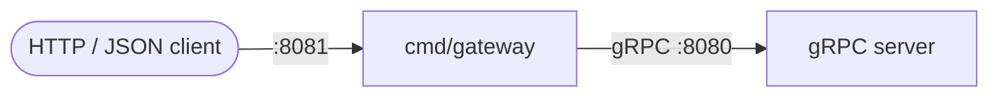
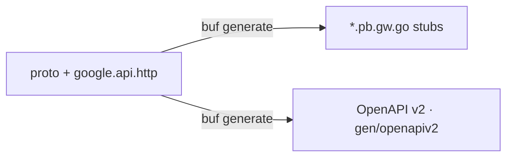

# HTTP/JSON gateway

> An optional REST facade over the gRPC API. Off by default.

A [grpc-gateway](https://github.com/grpc-ecosystem/grpc-gateway) reverse
proxy exposes the gRPC services over HTTP/JSON. It is never started by
`just run` or the default compose services.



## How it works

Routes come entirely from the `google.api.http` annotations on the proto
RPCs; nothing is hand-maintained. `just proto` regenerates both the
gateway stubs and a per-service OpenAPI v2 document.



The gateway forwards the `authorization`, `accept-language`, and
`x-request-id` headers, so authentication and i18n work through it
unchanged.

> [!NOTE]
> Client-streaming RPCs (avatar upload) are intentionally gRPC-only and
> are not exposed over REST.

## Enable it

Configure `configs/gateway.yaml` (values are env-substituted):

| Key | Env | Default | Meaning |
| --- | --- | --- | --- |
| `enabled` | `GATEWAY_ENABLED` | `false` | must be `true` to run |
| `listen_addr` | `GATEWAY_LISTEN_ADDR` | `:8081` | HTTP listen address |
| `upstream_addr` | `GATEWAY_UPSTREAM_ADDR` | *(empty)* | gRPC target; empty → local server port |

```sh
GATEWAY_ENABLED=true just gateway
```

When disabled, the binary logs and exits, safe to leave wired into a
process manager you have not opted into yet.

<details>
<summary>Example requests</summary>

```sh
# Public endpoint
curl -sX POST localhost:8081/v1/auth/login \
  -d '{"email":"a@b.com","password":"password123"}'

# Authenticated endpoint
curl -s localhost:8081/v1/users/me \
  -H "authorization: Bearer <token>"
```

</details>

---

**See also:** [gRPC API](grpc.md) · [Getting started](getting-started.md)
