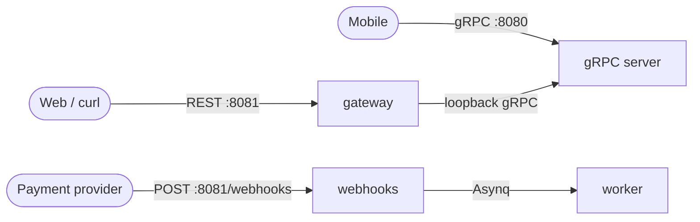

# HTTP surface

> A REST/JSON gateway and raw webhook endpoints, served alongside gRPC.

The server binary runs two listeners: native gRPC for mobile clients and
an HTTP server for everything else. The HTTP server is always on. It hosts
two distinct things:

1. a [grpc-gateway](https://github.com/grpc-ecosystem/grpc-gateway) REST/JSON
   mirror of the gRPC API, for the web admin panel, curl, and debugging;
2. raw `net/http` webhook handlers for payment providers and OAuth redirects,
   which do not go through the gateway.



## Gateway

Routes come entirely from the `google.api.http` annotations on the proto
RPCs; nothing is hand-maintained. `just proto` regenerates both the gateway
stubs and a per-service OpenAPI v2 document under `gen/openapiv2`, which is
the REST/curl documentation.

The gateway proxies to the in-process gRPC server over loopback, so there is
a single source of truth for both auth and errors:

- **Auth**: the gateway forwards the `authorization`, `accept-language`, and
  `x-request-id` headers as gRPC metadata, so the existing opaque-token
  interceptor authenticates REST calls with no duplicated logic. Admin RPCs
  keep their role check in the interceptor, so they stay protected over REST.
- **Errors**: a gateway error handler renders the gRPC status the error
  interceptor already produced. It does not re-map anything; it only
  translates the status code to an HTTP status and a consistent JSON body.

```json
{
  "error": {
    "code": "auth.invalid_token",
    "message": "The access token is invalid.",
    "status": "UNAUTHENTICATED",
    "fields": []
  }
}
```

`code` is the stable application code, `status` is the gRPC code name, and
`fields` carries request validation violations when present.

> [!NOTE]
> Client-streaming RPCs (avatar upload) are intentionally gRPC-only and are
> not exposed over REST.

## CORS

A CORS middleware wraps the HTTP server for the browser admin panel. Restrict
`CORS_ALLOWED_ORIGINS` in production; the default allows the local web app.

## Webhooks

Provider callbacks land on their own paths and bypass the token interceptor.
Their trust is the provider signature, verified against the raw request body:

| Provider | Path | Signature |
| --- | --- | --- |
| Wave | `POST /webhooks/wave` | HMAC-SHA256 of the body in `Wave-Signature` |
| Orange Money | `POST /webhooks/orange-money` | HMAC-SHA256 of the body in a configurable header |
| PayDunya | `POST /webhooks/paydunya` | SHA-512 of the master key in `X-Paydunya-Signature` |
| Stripe | `POST /webhooks/stripe` | `t=,v1=` HMAC-SHA256 over `timestamp.body`, with a freshness window |

Verification fails closed: an unset secret rejects every request. A verified
webhook is handed to the background worker over Asynq and acknowledged with
`202 Accepted`; no business logic runs in the request. Extend the worker
processor in `internal/worker/webhooks` to settle payments or emit events.

OAuth provider redirects land on `GET /oauth/{provider}/callback`. The
handler validates the `oauth_state` CSRF cookie, hands the code exchange to
the worker, and redirects the browser back to the web app.

## Configure it

`configs/http.yaml` (values are env-substituted):

| Key | Env | Default | Meaning |
| --- | --- | --- | --- |
| `listen_addr` | `HTTP_LISTEN_ADDR` | `:8081` | HTTP listen address |
| `cors.allowed_origins` | `CORS_ALLOWED_ORIGINS` | `http://localhost:3000` | comma-separated origins, or `*` |
| `webhooks.wave.secret` | `WAVE_WEBHOOK_SECRET` | *(empty)* | Wave signing secret |
| `webhooks.orange_money.secret` | `ORANGE_MONEY_WEBHOOK_SECRET` | *(empty)* | Orange Money signing secret |
| `webhooks.paydunya.master_key` | `PAYDUNYA_MASTER_KEY` | *(empty)* | PayDunya master key |
| `webhooks.stripe.signing_secret` | `STRIPE_WEBHOOK_SECRET` | *(empty)* | Stripe signing secret |

<details>
<summary>Example requests</summary>

```sh
# Public endpoint
curl -sX POST localhost:8081/v1/auth/login \
  -d '{"email":"a@b.com","password":"password123"}'

# Authenticated endpoint
curl -s localhost:8081/v1/users/me \
  -H "authorization: Bearer <token>"
```

</details>

---

**See also:** [gRPC API](grpc.md) · [Getting started](getting-started.md)
