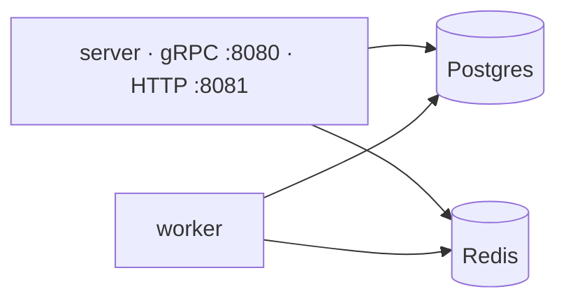

# Getting started

> Run the stack locally and make your first call.

## Prerequisites

| Tool | Purpose |
| --- | --- |
| Go 1.26+ | build and run the services |
| Docker | Postgres, Redis, and MinIO |
| [just](https://github.com/casey/just) | task runner |
| [buf](https://buf.build) | protobuf generation |
| Node 24+ and [pnpm](https://pnpm.io) | only for editing email templates |

## Setup

```sh
cp .env.example .env
just up          # start postgres + redis + minio
just migrate     # apply migrations
just run         # gRPC on :8080, HTTP surface on :8081
```

The server binary serves two listeners: native gRPC on `:8080` and the
HTTP surface (REST gateway + webhooks) on `:8081`. The worker is a
separate binary over the same infrastructure:



Run the worker with `just worker`.

## Call the API

The server enables gRPC reflection by default in development
(`GRPC_REFLECTION`, disable it on internet-facing deployments), so
`grpcurl` can explore it:

```sh
grpcurl -plaintext localhost:8080 list

grpcurl -plaintext \
  -d '{"email":"a@b.com","password":"password123","first_name":"A","last_name":"B"}' \
  localhost:8080 auth.v1.AuthService/Register
```

Authenticated calls pass the access token as metadata:

```sh
grpcurl -plaintext -H "authorization: Bearer <token>" \
  localhost:8080 user.v1.UserService/GetMe
```

> [!TIP]
> Prefer REST? The [HTTP surface](gateway.md) mirrors the same RPCs on
> `:8081`, so `curl localhost:8081/v1/users/me` works out of the box.

## Observability

The API serves operational endpoints on `:9090` (`METRICS_PORT`) and
the worker on `:9091` (`WORKER_METRICS_PORT`):

| Endpoint | Purpose |
| --- | --- |
| `/metrics` | Prometheus metrics (RPCs, outbox, cache, DB and Redis pools) |
| `/healthz` | liveness |
| `/readyz` | readiness (checks Postgres + Redis) |
| `/debug/pprof/` | profiling, only when `PPROF_ENABLED=true` |

---

**See also:** [Architecture](architecture.md) · [gRPC API](grpc.md)
