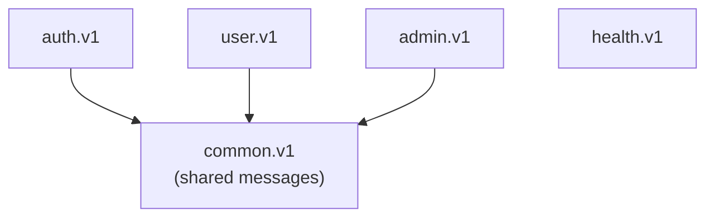

# gRPC API

> The protobuf API, its per-domain layout, and how to extend it.

The API is defined in `api/proto/<domain>/v1`, one protobuf package per
domain. Shared messages live in `common.v1`; every other package imports
it. Generated Go lives in `gen/` and is never edited by hand.



## Services

| Service | Package | Purpose |
| --- | --- | --- |
| `HealthService` | `health.v1` | liveness and readiness |
| `AuthService` | `auth.v1` | register, login, tokens, devices, password reset |
| `UserService` | `user.v1` | own profile, settings, avatar upload, push tokens |
| `AdminService` | `admin.v1` | user management (admin role) |

> [!NOTE]
> These are example domains. A project built on this template will
> replace them; the layout and the steps below are what carry over.

## Regenerate

```sh
just proto   # buf lint && buf generate
```

## Add an RPC

1. Add the RPC and its messages to the domain `.proto`, reusing
   `common.v1` messages where they fit. Declare validation rules on the
   request fields with [`buf.validate`](https://buf.build/docs/protovalidate/overview/)
   annotations; the validation interceptor enforces them before the
   handler runs.
2. Run `just proto`.
3. Implement the method on the matching server in `internal/grpcsvc`,
   mapping protobuf ↔ domain, and call a domain service for the work.
4. Return errors from `internal/errs`, never a `status.Status`.

## Add a service

<details>
<summary>Full checklist for a new domain service</summary>

1. Create `api/proto/<domain>/v1/<domain>.proto` with
   `package <domain>.v1` and a `service`; import
   `common/v1/common.proto` for shared messages.
2. Run `just proto`.
3. Add a server type in `internal/grpcsvc` that embeds the generated
   `Unimplemented<Name>ServiceServer`, and register it in
   [`server.go`](../internal/grpcsvc/server.go).
4. If the service is public or admin-only, add its
   `/<domain>.v1.<Service>/<Method>` route strings to `publicMethods` /
   `adminServicePrefix` in
   [`internal/interceptor/interceptors.go`](../internal/interceptor/interceptors.go).

</details>

> [!IMPORTANT]
> Public methods (register, login, refresh, verify, reset) are listed in
> the interceptor package. Everything else requires a bearer token.

---

**See also:** [Architecture](architecture.md) · [HTTP/JSON gateway](gateway.md) · [Authentication](authentication.md)
